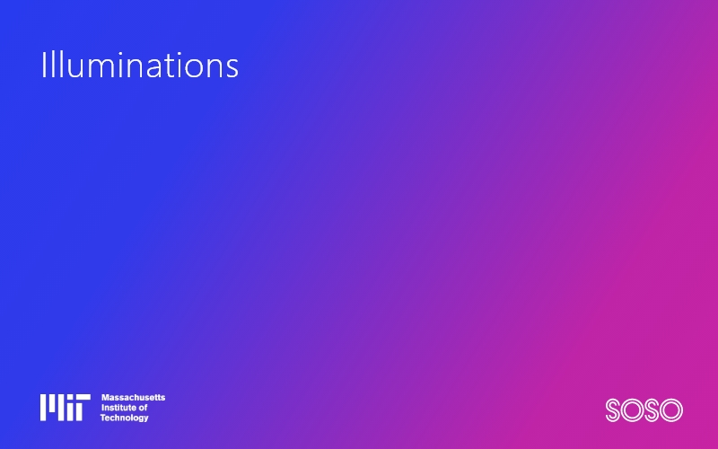
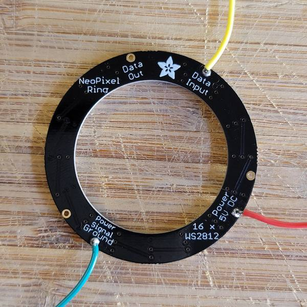
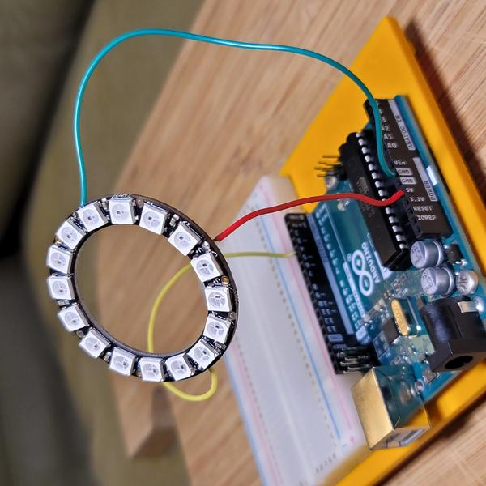
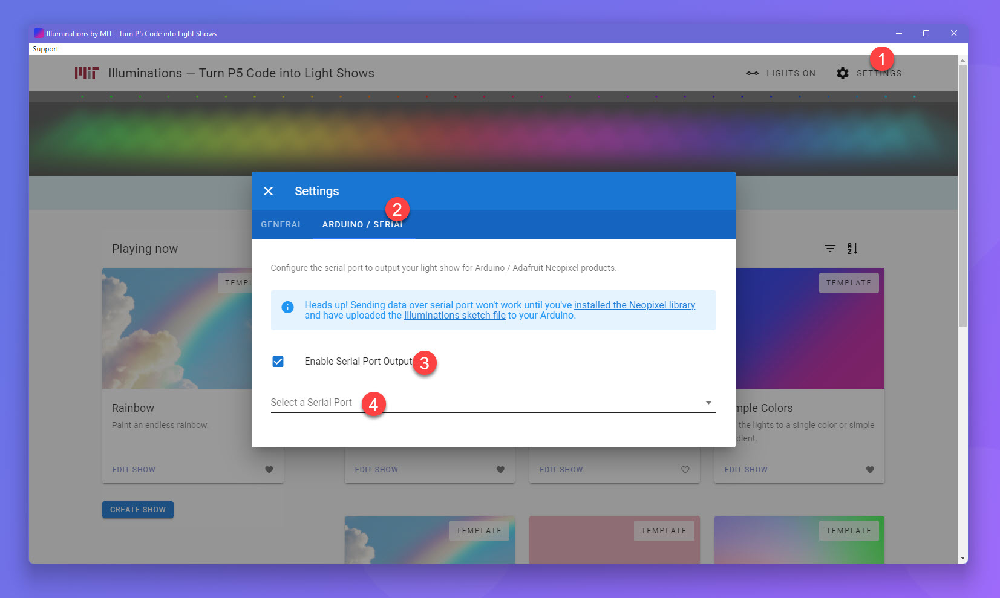

# Illuminations by MIT



MIT Illuminations is a dynamic light installation at the MIT Welcome Center controlled by open-source code contributed by MIT students and the general public. See the lights in person by visiting the MIT Welcome Center at 292 Main Street in Cambridge, MA.

This open source application takes P5 code and visualizes/outputs it to various professional and hobbyist lighting units, making creating light shows easy and accessible.

## Download the latest stable version

To download the latest stable release, visit https://illuminations.mit.edu/, or download directly from [GitHub](https://github.com/sosolimited/MIT-Illuminations/releases).

---

## Getting Started Guide

Welcome, and thanks for downloading Illuminations by MIT. In no time at all you'll be creating light shows in P5 code, and seeing those shows run on LED fixtures. This guide will take your through both the software and hardware setup of an example project, but you can also just skip the hardware portion if you don't have/want to buy an LED fixture. Let's jump right in.

### What you'll need:

- A computer with an available USB port.
- [Arduino Uno Rev3](https://store-usa.arduino.cc/collections/boards/products/arduino-uno-rev3) or comparable Arduino board.
- [USB Cable (A to B)](https://www.amazon.com/AmazonBasics-Printer-Type-Cable-Male/dp/B00NH11KIK)
- [Soldering Iron](https://www.amazon.com/Sonrinss-Electronics-Adjustable-Temperature-Desoldering/dp/B088LZRJM2) with some [Solder Wire](https://www.amazon.com/MAIYUM-63-37-Solder-Electrical-Soldering/dp/B075WB98FJ)
- A Neopixel LED product _(for our example, we'll use a [16 LED RGB Ring](https://www.adafruit.com/product/1463))_
- A handful of [male-to-male (m/m) Jumper Wires](https://www.amazon.com/Solderless-Flexible-Breadboard-Jumper-100pcs)

### Step 1. Software installation

1. Download and install [Illuminations by MIT](https://github.com/sosolimited/MIT-Illuminations/releases) _(see above)_.
2. Download and install the [Arduino IDE](https://www.arduino.cc/en/software) for your operating system.
3. Within the Arduino IDE, install the [Neopixel Library](https://github.com/adafruit/Adafruit_NeoPixel).

### Step 2. Hardware setup

1. Let's begin by warming up our soldering iron, and soldering 3 male jumper wires to the `Power 5V DC`, `Power Signal Ground`, and `Data Input` ports on our Neopixel ring.



2. Plug the other ends of those cables into your Arduino, as follows:
   1. Connect `Power 5V DC` into the `5V` port on the Arduino.
   2. Connect `Power Signal Ground` into the `GND` port on the Arduino (next to `5V`).
   3. Connect `Data Input` into the `DIGITAL 4` port on the Arduino.



3. Connect your Arduino to your USB port on your computer using the USB cable. You should see a little power light turn on.

### Step 3. Arduino configuration

1. Open the Arduino IDE and copy the code from [this link](https://github.com/sosolimited/MIT-Illuminations/blob/master/arduino/illuminations.ino) into a brand new blank sketch.
2. Update the values on line `11` and `14` of this code to match your LED device.
   1. `LED COUNT` is the number of LED lights _(in our example, it should be `16`)_
   2. `N_COLORS` should be `3` for RGB units, and `4` for RGB+W _(in our example, that's `3`)_
3. Make sure you have your Arduino Uno selected within the IDE, and hit **"_Upload_"**. This publishes the code to your Arduino.
4. You can close the IDE. Your Arduino will remember and run this code every time it powers on, meaning it will always be ready to accept data from the Illuminations application, so long as it's plugged in via USB.

### Step 4. Setup illuminations

1. Open the MIT Illuminations application.
2. Click on "Settings", on the "General" tab.
3. Set the number of lights and RGB value to match your Neopixel device _(in our case, 16 lights in RGB)_.
4. Click on the "Arduino/Serial" tab, and turn on "Enable Serial Port Output". Select your Arduino port from the list below. On Windows it'll start with `COM...`, while on Mac expect something like `/dev/tty...`.
5. You'll know if your Arduino is receiving data correctly, as a data light will flicker constantly on the board so long as the Illuminations application is running.
 


### Step 5. Magic 🪄

If everything worked, at this point your Neopixels should be lighting up and matching the preview shown in the application. You can start by editing some of the templates, or go wild and create your own. Have fun programming! 😎

---

## Advanced: Fork the repo and make changes

**Note: Most users won't need to do this - you can just download and install the latest release above.** If you want to make changes to the codebase of the application itself, and build it locally - follow the steps below:

### Install NodeJS and NPM

Install [node.js](https://nodejs.org/en/download/) (tested with Node 14.x and 16.x). npm needs to be at least version 8.x. Update your `npm` dep after Node installation: `npm install -g npm@latest`.

### To begin, run the installation script

Fork/clone this repo to a folder on your local machine. From within that folder, run:

```
npm install
```

Then to start the dev app: 
```
npm start
```

You're all set. Go ahead and make any changes to the codebase that you need. Enjoy programming :)

### To Build Production Releases

**Windows**
```
npm run make-windows-release
```

**Mac**
1. Follow [this guide](build/README.md) to prepare your dev environment for code signing and notarization.
2. `npm run make-mac-release`